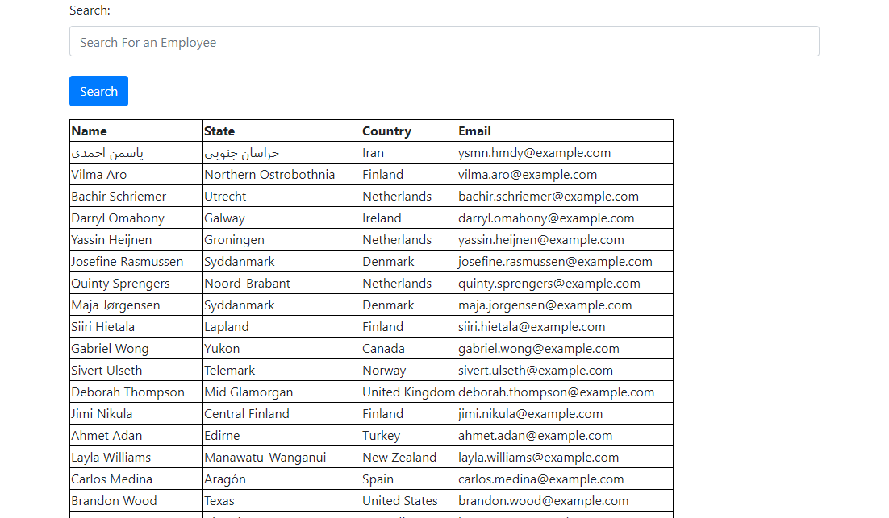

# React-Employee Directory

## Description: 
Tasked with designing a React based employee directory capable of presenting employee data, and searching for individual results, we succeeded in presenting a simple, intuitive application which meets all requirements provided by the client. 
## Table of Contents

-[Description](#description)

-[Installation](#installation)

-[Instructions](#instructions)

-[Licenses](#licenses)

-[Deployed](#deployed)

-[Contact](#contact)

-[Contributors](#Contributors)

-[Testing](#Tests)

## Installation:
The project utilized React, Bootstrap, Axios, as well as gh-pages npm for deployment. 
## Instructions:
By visting the site, you are presented with employee data which is not sensitive information. You can then utilize the search function to find individual employees with part or all of their name.
### Licenses: 

### Deployed: 
[https://boylepeter.github.io/react_employee_directory](https://boylepeter.github.io/react_employee_directory)

### Contact:

[Github](https://github.com/boylepeter)

[LinkedIn](https://www.linkedin.com/in/peter-boyle-22b5071b7/)

Email: [Boyle.Peter614@gmail.com](Boyle.Peter614@gmail.com)

### Contributors: 
None

### Tests: 
Please feel free to try the app yourself and let me know if you have any questions or comments!
